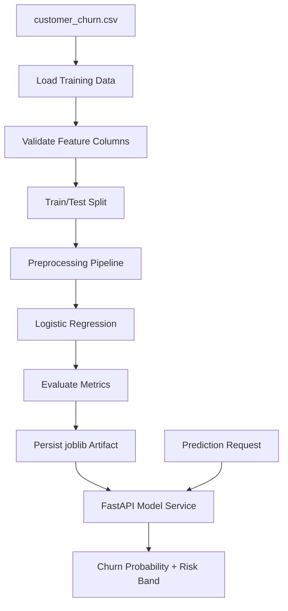

# Churn Prediction Service — End-to-End ML Training & Serving Pipeline

A FastAPI-based machine learning service that trains a churn prediction model, persists the model artifact, and serves customer-level churn predictions through an API.

This project demonstrates a classic production ML workflow:

```text
CSV training data
-> feature validation
-> preprocessing pipeline
-> model training
-> evaluation metrics
-> persisted model artifact
-> FastAPI prediction endpoint
```

---

## Why I Built This

Applied AI engineering is not only LLM orchestration. Many AI application roles still expect strong fundamentals around supervised learning, model evaluation, and model serving.

This project shows that foundation in a SaaS customer-retention context.

---

## Features

- 500-row synthetic SaaS churn dataset with realistic noise (generated via `scripts/generate_dataset.py`)
- scikit-learn preprocessing pipeline
- one-hot encoding for categorical features
- standard scaling for numeric features
- logistic regression classifier with balanced class weights
- train/test split with evaluation metrics
- persisted model artifact with `joblib`
- FastAPI serving endpoints (`/predict`, `/model-info`, `/health`, `/reload-model`)
- Pydantic input validation with Literal types and value constraints
- graceful degradation when model artifact is missing
- model hot-reload without server restart
- model interpretability via logistic regression coefficients
- unit and API tests with pytest (24 tests)

---

## Model Inputs

The model uses business-readable SaaS account features:

| Feature | Description |
|---|---|
| `tenure_months` | How long the customer has been active |
| `monthly_charges` | Current monthly recurring charge |
| `total_charges` | Lifetime charges to date |
| `support_tickets_last_90d` | Recent support ticket volume |
| `contract_type` | `month_to_month`, `annual`, or `two_year` |
| `payment_method` | `credit_card`, `bank_transfer`, or `invoice` |
| `has_auto_pay` | Whether automatic payment is enabled |
| `product_tier` | `starter`, `standard`, or `enterprise` |
| `seats` | Number of licensed seats |

---

## Architecture



---

## Project Structure

```text
churn-prediction-service/
  app/
    __init__.py
    main.py
    schemas.py
    services/
      __init__.py
      features.py
      model_service.py
      training.py
  data/
    customer_churn.csv
  models/
    .gitkeep
  scripts/
    generate_dataset.py
    train_model.py
  tests/
    conftest.py
    test_api.py
    test_model_service.py
    test_training.py
  README.md
  requirements.txt
  pytest.ini
  .env.example
  .gitignore
  .dockerignore
  Dockerfile
  Makefile
```

---

## API Endpoints

### `GET /health`

Checks whether the API is running and whether a model artifact is loaded. Returns `{"status": "degraded", "model_loaded": false}` when no model is available.

### `GET /model-info`

Returns model version, training timestamp, feature columns, and evaluation metrics. Returns `503` if no model is loaded.

### `POST /predict`

Predicts churn risk for one customer account. A churn probability at or above the threshold is classified as `"churn"` (>= comparison).

Example request:

```json
{
  "customer": {
    "tenure_months": 8,
    "monthly_charges": 129.0,
    "total_charges": 1032.0,
    "support_tickets_last_90d": 5,
    "contract_type": "month_to_month",
    "payment_method": "credit_card",
    "has_auto_pay": false,
    "product_tier": "standard",
    "seats": 12
  },
  "threshold": 0.5
}
```

Example response:

```json
{
  "prediction": "churn",
  "churn_probability": 0.8732,
  "threshold": 0.5,
  "risk_band": "high",
  "model_version": "0.1.0"
}
```

### `POST /reload-model`

Clears the cached model and reloads the artifact from disk. Use after retraining to pick up the new model without restarting the server.

```json
{"status": "ok", "message": "Model reloaded."}
```

### `GET /feature-importance`

Returns logistic regression coefficients sorted by absolute magnitude. Each entry includes the feature name, coefficient value, and whether it increases or decreases churn probability.

Example response (truncated):

```json
[
  {"feature": "contract_type_month_to_month", "coefficient": 1.4231, "direction": "increases_churn"},
  {"feature": "tenure_months", "coefficient": -0.8912, "direction": "decreases_churn"},
  {"feature": "support_tickets_last_90d", "coefficient": 0.6543, "direction": "increases_churn"}
]
```

---

## Model Interpretability

The `/feature-importance` endpoint exposes the logistic regression coefficients after one-hot encoding. This provides a simple but effective interpretability layer:

- **Positive coefficients** increase churn probability (e.g., month-to-month contracts, high support tickets).
- **Negative coefficients** decrease churn probability (e.g., long tenure, auto-pay enabled).
- **Sorted by absolute magnitude** so the most impactful features appear first.

This is not a full explainability framework (SHAP, LIME), but it demonstrates awareness of model interpretability — a common interview topic for applied AI roles.

---

## Running Locally

Create and activate a virtual environment:

```bash
python3 -m venv .venv
source .venv/bin/activate
```

Install dependencies:

```bash
pip install -r requirements.txt
```

Train the model:

```bash
python scripts/train_model.py
```

Run the API:

```bash
uvicorn app.main:app --reload
```

Open Swagger UI:

```text
http://127.0.0.1:8000/docs
```

---

## Docker

The Dockerfile trains the model at build time, so the image is self-contained. This is a demo packaging decision — in production, the model would be trained externally and deployed as a versioned artifact.

```bash
docker build -t churn-prediction-service .
docker run -p 8000:8000 churn-prediction-service
```

---

## Running Tests

```bash
python -m pytest
```

---

## Dataset Note

The dataset is synthetic (500 rows, ~37% churn rate) and generated by `scripts/generate_dataset.py`. Churn probability is driven by contract type, tenure, auto-pay status, and support ticket volume, with Gaussian noise added so the model cannot achieve perfect separation.

Current evaluation metrics:

| Metric | Value |
|---|---|
| Accuracy | 0.728 |
| Precision | 0.597 |
| Recall | 0.851 |
| F1 | 0.702 |
| ROC AUC | 0.796 |

In a real deployment, this would need a larger historical dataset, cross-validation, calibration, monitoring, and drift checks.

---

## Roadmap

- Add cross-validation
- Add model calibration
- Add batch prediction endpoint
- Add drift checks for incoming production data
